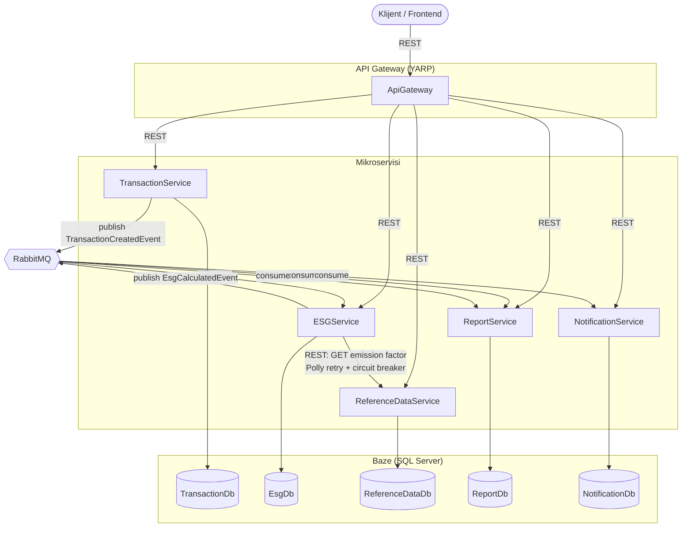

# Arhitektura — GreenFinance

## Mikroservisi

| Servis | Baza | Odgovornost |
| --- | --- | --- |
| ApiGateway (YARP) | – | reverse proxy ka svim servisima |
| TransactionService | `TransactionDb` | kreiranje/pregled transakcija, publikuje `TransactionCreatedEvent` |
| ESGService | `EsgDb` | računa CO2/ESG rezultat, publikuje `EsgCalculatedEvent` |
| ReferenceDataService | `ReferenceDataDb` | referentni podaci (kategorije, emisijski faktori) |
| ReportService | `ReportDb` | agregirani periodični izveštaji |
| NotificationService | `NotificationDb` | obaveštenja pri niskom ESG score-u |

Sve baze su logički odvojene (svaki servis ima svoju bazu i pristupa samo njoj), ali
radi jednostavnijeg lokalnog/dev okruženja hostovane su na jednoj SQL Server instanci
(vidi [`deployment.md`](deployment.md)).

## Dijagram sistema

## Sinhrona komunikacija

- Gateway rutira REST pozive klijenta ka odgovarajućem servisu (`/transactions/**` →
  TransactionService, `/esg/**` → ESGService, `/categories/**` i
  `/emission-factors/**` → ReferenceDataService, `/reports/**` → ReportService,
  `/notifications/**` → NotificationService).
- ESGService sinhrono zove ReferenceDataService (`GET /categories/{category}`) da
  dobije CO2 faktor. Ovaj poziv je obmotan Polly retry (3 pokušaja, eksponencijalni
  back-off) i circuit breaker politikom — kada je ReferenceDataService nedostupan,
  circuit se otvara i ESGService odmah vraća/upisuje status
  `temporarily_unavailable` umesto da blokira ili propagira grešku.

## Asinhrona komunikacija (RabbitMQ, MassTransit)

| Event | Publisher | Consumer(i) |
| --- | --- | --- |
| `TransactionCreatedEvent` | TransactionService | ESGService, ReportService |
| `EsgCalculatedEvent` | ESGService | NotificationService, ReportService |

Event-driven pristup omogućava da ReportService gradi sopstveni read-model bez
sinhronih poziva ka drugim servisima (svaki servis ostaje vlasnik svojih podataka), a
NotificationService reaguje na ESG rezultate bez direktne zavisnosti od ESGService-a.

## Kontejnerizacija

Svaki servis ima svoj `Dockerfile` (multi-stage build: SDK image za restore/publish,
ASP.NET runtime image za pokretanje). `deploy/docker-compose.yml` orkestrira:

- 5 mikroservisa + ApiGateway
- 1 SQL Server 2022 kontejner (5 logičkih baza)
- 1 RabbitMQ (management) kontejner

Detalji pokretanja i CI/CD pipeline-a nalaze se u [`deployment.md`](deployment.md).
