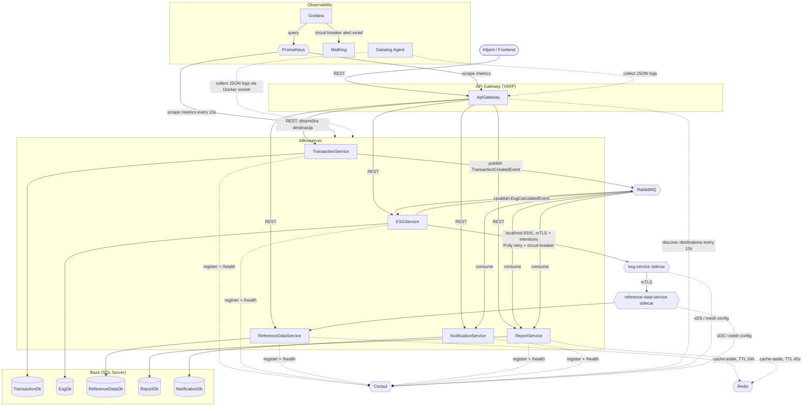

# Arhitektura — GreenFinance

## Mikroservisi

| Servis | Baza | Odgovornost |
| --- | --- | --- |
| ApiGateway (YARP) | – | reverse proxy ka svim servisima, dinamički otkriva destinacije preko Consul-a |
| TransactionService | `TransactionDb` | kreiranje/pregled transakcija, publikuje `TransactionCreatedEvent` |
| ESGService | `EsgDb` | računa CO2/ESG rezultat, publikuje `EsgCalculatedEvent` |
| ReferenceDataService | `ReferenceDataDb` | referentni podaci (kategorije, emisijski faktori) |
| ReportService | `ReportDb` | agregirani periodični izveštaji |
| NotificationService | `NotificationDb` | obaveštenja pri niskom ESG score-u |

Sve baze su logički odvojene (svaki servis ima svoju bazu i pristupa samo njoj), ali
radi jednostavnijeg lokalnog/dev okruženja hostovane su na jednoj SQL Server instanci
(vidi [`deployment.md`](deployment.md)).

## Dijagram sistema

## Sinhrona komunikacija

- Gateway rutira REST pozive klijenta ka odgovarajućem servisu (`/transactions/**` →
  TransactionService, `/esg/**` → ESGService, `/categories/**` i
  `/emission-factors/**` → ReferenceDataService, `/reports/**` → ReportService,
  `/notifications/**` → NotificationService) — destinacije se **ne** čitaju iz
  statičkog fajla, već se svakih 10s osvežavaju iz Consul-ovog health kataloga (vidi
  "Service discovery" ispod).
- ESGService sinhrono zove ReferenceDataService (`GET /categories/{category}`) da
  dobije CO2 faktor. Ovaj poziv je obmotan Polly retry (3 pokušaja, eksponencijalni
  back-off), circuit breaker i timeout politikom — kada je ReferenceDataService
  nedostupan, circuit se otvara i ESGService odmah vraća/upisuje status
  `temporarily_unavailable` umesto da blokira ili propagira grešku. Timeout je
  namerno implementiran kao Polly-jeva sopstvena strategija (`AddTimeout`), a ne kao
  `HttpClient.Timeout` — ovo poslednje baca običan `TaskCanceledException` koji
  Polly-jev podrazumevani predikat ne prepoznaje kao tranzijentnu grešku, pa bi
  retry/circuit breaker tiho nikad ne bili aktivirani. Ovaj poziv od DIS-45 ide kroz
  Consul Connect mesh (mTLS + intentions) — vidi "Service mesh" ispod; gateway-ove
  REST putanje ka svih 5 servisa ostaju van mesh-a, nepromenjene.

## Service mesh (Consul Connect) — scoped na ESGService → ReferenceDataService

Obim je **namerno ograničen** na jedini stvarni sinhroni servis-servis poziv u
sistemu (gore) — ne pun mesh preko svih 5 servisa i gateway-a. Razlog: pun mesh bi
zahtevao sidecar uz svaki servis i gateway (skoro dupliranje broja kontejnera) i
naterao bi YARP gateway da napusti već izgrađeno dinamičko Consul-catalog
otkrivanje (vidi "Service discovery" ispod) za meš-ovane servise. Gateway i ostala
3 servisa (TransactionService, ReportService, NotificationService) nemaju
sinhrone HTTP pozive među sobom — samo RabbitMQ, na koji mesh ne utiče — pa ostaju
potpuno van mesh-a.

Mehanizam:

- Consul dev-agent ima Connect uključen sa auto-generisanim built-in CA (dev mod
  podrazumevano). Node ime je pinovano (`-node=consul-dev`) da ostane stabilno
  kroz restart kontejnera — `consul-dataplane` sidecar-i rade node-scoped lookup-e
  koji bi se pokvarili da se ime menja.
- `ReferenceDataService` i `ESGService` svaki dobijaju sopstveni
  `hashicorp/consul-dataplane:1.9` sidecar kontejner
  (`reference-data-service-sidecar`, `esg-service-sidecar`), pokrenut sa
  `network_mode: "service:<app>"` (deli network namespace sa app kontejnerom).
  `GreenFinance.ServiceDiscovery` (`ConsulOptions.Sidecar`,
  `ConsulRegistrationHostedService`) opciono registruje sidecar (`Connect.
  SidecarService`) kao deo servisne registracije — Consul auto-dodeljuje sidecar-u
  inbound port (dev opseg `21000+`) i, za ESGService, upstream lokalni bind port
  (`9191`) ka `reference-data-service`.
- Consul ne dozvoljava eksplicitan ID na sidecar registraciji ("managed by the
  agent") — auto-generisani ID (`<parent-id>-sidecar-proxy`) zavisi od
  hostname/IP-a app kontejnera, pa ga app upisuje u fajl na deljenom volume-u
  (`/consul-sidecar/proxy-id`) posle uspešne registracije; sidecar ga čita preko
  `-proxy-id-path`.
- ESGService-ov `ReferenceDataService__BaseUrl` (samo u docker-compose okruženju,
  `appsettings.json` za lokalni dev ostaje nepromenjen) je od DIS-45 postavljen na
  `http://localhost:9191/` — poziv ide kroz sopstveni sidecar, mTLS do
  ReferenceDataService-ovog sidecar-a, pa na app port 8080. `-tls-disabled` na
  `consul-dataplane` komandi utiče samo na control-plane kanal (dataplane→Consul
  server), NE na data-plane mTLS između servisa (to izdaje Consul-ova Connect CA
  nezavisno).
- **Service intentions** (`deploy/consul/intentions/*.hcl`, primenjeni preko
  one-shot `consul-intentions-init` kontejnera na svaki `docker compose up`, jer
  dev-mode Consul config-entry store nije perzistentan): default-deny (`*` → `*`)
  plus eksplicitan allow (`esg-service` → `reference-data-service`, viši
  precedence od wildcard-a). Verifikovano uživo: privremeni deny na tom pravilu
  odmah obara poziv (`GET /esg/transaction/{id}` vraća `temporarily_unavailable`,
  `esg_referencedata_circuit_state` gauge ide na 1) — vraćanjem na allow saobraćaj
  se oporavlja.

Provera i primeri komandi: [`deployment.md`](deployment.md).

## Asinhrona komunikacija (RabbitMQ, MassTransit)

| Event | Publisher | Consumer(i) |
| --- | --- | --- |
| `TransactionCreatedEvent` | TransactionService | ESGService, ReportService |
| `EsgCalculatedEvent` | ESGService | NotificationService, ReportService |

Event-driven pristup omogućava da ReportService gradi sopstveni read-model bez
sinhronih poziva ka drugim servisima (svaki servis ostaje vlasnik svojih podataka), a
NotificationService reaguje na ESG rezultate bez direktne zavisnosti od ESGService-a.

## Service discovery (Consul)

Svaki od 5 business servisa se registruje u Consul pri startu
(`GreenFinance.ServiceDiscovery` building block — `ConsulRegistrationHostedService`),
sa HTTP health check-om ka svom `/health` endpoint-u (interval 10s). Registracija je
namerno **ne-fatalna**: ako Consul privremeno nije dostupan, servis i dalje starta
normalno (samo loguje upozorenje i pokušava ponovo) — ovo drži integracione testove
(koji ne pokreću Consul) jednostavnim (`Consul:Enabled=false`). Adresa pod kojom se
servis registruje je kontejnerov hostname (`Dns.GetHostName()`), jedinstven po
instanci — ovo je ono što omogućava da više replika istog servisa (vidi
"Skaliranje" ispod) registruje odvojene, razlikovane unose u Consul katalogu umesto
da se prepisuju jedna preko druge.

ApiGateway ne koristi statičku `appsettings.json` `ReverseProxy` konfiguraciju — umesto
toga, custom `IProxyConfigProvider` (`ConsulProxyConfigProvider` +
`ConsulProxyRefreshHostedService`) svakih 10s upita Consul-ov `/v1/health/service/{name}`
za svaki od 5 servisa i dinamički gradi YARP cluster destinacije samo od instanci koje
su trenutno "passing". Kad se servis ugasi, njegova ruta u gateway-u vraća 503 u roku
od jednog refresh ciklusa; kad se vrati, saobraćaj se automatski nastavlja. Svaki
klaster ima eksplicitno postavljenu `RoundRobin` load balancing politiku, tako da se
saobraćaj ravnomerno raspoređuje kad klaster ima više od jedne zdrave destinacije.

Consul UI: `http://localhost:8500`.

### Skaliranje (horizontalno, load balancing)

`TransactionService` i `ESGService` su podešeni da rade kao više instanci
(`docker compose --scale`) — mehanizam je generički (radi za bilo koji od 5
servisa), demonstriran konkretno na ova dva kao najzahtevnijim putanjama (ulazna
tačka sistema i sinhroni hot-path servis). Skalirane instance nemaju fiksni
host-port mapping niti `container_name` u `deploy/docker-compose.yml` (Compose to
zahteva za `--scale`) — dostupne su isključivo preko gateway-a. Detalji i primeri
komandi: [`deployment.md`](deployment.md).

## Monitoring i alarmiranje (Prometheus, Grafana)

Svih 5 servisa + ApiGateway izlažu `/metrics` (OpenTelemetry + Prometheus exporter,
`GreenFinance.Observability` building block): ugrađene ASP.NET Core/HttpClient/runtime
metrike, MassTransit metrike, i custom business brojači
(`transactions.created`, `esg.results.calculated`/`esg.results.unavailable`,
`notifications.sent`) i gauge za stanje ESGService → ReferenceDataService circuit
breaker-a (`esg.referencedata.circuit_state`: 0=zatvoren, 1=otvoren, 2=poluotvoren),
ažuriran preko Polly `OnOpened`/`OnClosed`/`OnHalfOpened` callback-ova.

Prometheus (`http://localhost:9090`) skrejpuje svih 6 `/metrics` endpoint-a na 15s.
Grafana (`http://localhost:3000`, admin/admin) je provisioned sa Prometheus
datasource-om, starter dashboard-om ("GreenFinance Overview") i jednim alert
pravilom: kad `esg_referencedata_circuit_state` pređe 0 (otvoren), Grafana šalje email
alert preko SMTP-a ka MailHog-u (`http://localhost:8025` — lokalni SMTP catcher, ne
šalje prave mejlove). Ovo je konkretna realizacija "mail bazirani notifikacioni
kanali" + "alarm na circuit breaker-om" bonus stavki iz predloga.

## Keširanje (Redis)

Deljeni `redis` kontejner (`http://localhost:6379`, samo interna mreža) služi kao
distribuirani keš za dva slučaja:

- **ReferenceDataService** (`CachedEmissionFactorRepository`) — emisijski faktori
  su statični seed podaci bez ijednog write endpoint-a u servisu, pa se keširaju sa
  dugim TTL-om (24h). Ovo je najfrekventniji sinhroni poziv u sistemu (ESGService
  ga zove jednom po transakciji), pa keširanje direktno smanjuje DB opterećenje na
  hot path-u.
- **ReportService** (`ReportCache`) — `GET /reports/company/{id}` agregatni
  izveštaj, kratak TTL (45s) uz eksplicitnu invalidaciju iz oba event konzumera
  (`TransactionCreatedEventConsumer`/`EsgCalculatedEventConsumer`) posle svakog
  upisa u pogođeni company/period — jer se ovi podaci, za razliku od emisijskih
  faktora, stvarno menjaju u runtime-u.

Oba mesta koriste `IDistributedCache` (`Microsoft.Extensions.Caching.StackExchangeRedis`)
kao **best-effort** sloj: nedostupan Redis nikad ne obara zahtev — svaki keš poziv
je u `try/catch` i pada nazad na direktan upit ka bazi ako Redis ne odgovori
(`AbortOnConnectFail = false` + kratki connect/sync timeout-i, da fallback bude
brz umesto da blokira zahtev).

## Centralizovano logovanje (Datadog)

Svi servisi loguju strukturisani JSON na stdout (`builder.Logging.AddJsonConsole()`).
Datadog Agent kontejner (montira Docker socket) kupi logove svih kontejnera
(`DD_LOGS_CONFIG_CONTAINER_COLLECT_ALL`) i taguje ih po servisu preko
`com.datadoghq.ad.logs` Docker labela. Zahteva pravi `DD_API_KEY` u lokalnom
`deploy/.env` (vidi [`deployment.md`](deployment.md)) — bez njega agent starta
normalno ali ne uspeva da isporuči telemetriju Datadog-u.

## Kontejnerizacija

Svaki servis ima svoj `Dockerfile` (multi-stage build: SDK image za restore/publish,
ASP.NET runtime image za pokretanje). `deploy/docker-compose.yml` orkestrira:

- 5 mikroservisa + ApiGateway
- 1 SQL Server 2022 kontejner (5 logičkih baza)
- 1 RabbitMQ (management) kontejner
- Consul (service discovery) + `consul-intentions-init` (one-shot, primenjuje
  service intentions) + 2 `consul-dataplane` sidecar kontejnera (scoped service
  mesh — ReferenceDataService, ESGService)
- Redis (keširanje — ReferenceDataService, ReportService)
- Prometheus + Grafana + MailHog (monitoring i alarmiranje)
- Datadog Agent (centralizovano logovanje)

Detalji pokretanja i CI/CD pipeline-a nalaze se u [`deployment.md`](deployment.md).
